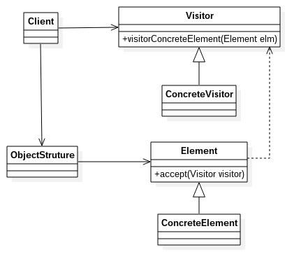
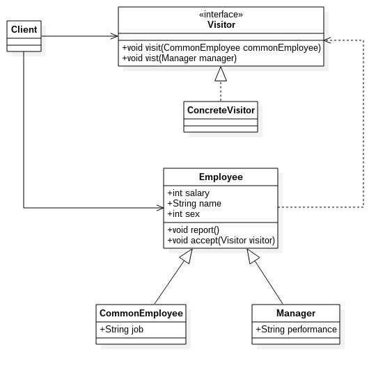

# 访问者模式
---
访问者模式：封装一些作用于某种数据结构中的各元素的操作，它可以在不改变数据结构的前提下定义作用于这些元素的操作。 
**类图** 

类图中角色说明
- Visitor 抽象访问者：抽象类或接口。声明访问者可以访问哪些元素，具体到程序中就是visit方法的参数定义哪些对象是可以被访问的
- ConcreteVisitor 具体访问者：它影响访问者访问到一个类后该怎么干，要做什么事情
- Element 抽象元素：接口或者抽象类，声明接受哪一类访问者访问，程序上通过accept方法中的参数来定义
- ConcreteElement 具体元素
- ObjectStruture 结构对象：元素产生者，一般容纳在多个不同的类、不同的接口的容器，如List、Map、Set等

		//抽象元素
		public abstract class Element {
			//定义业务逻辑
			public abstract void doSomething();
			//允许谁来访问
			public abstract void accept(Visitor visitor);
		}

		//具体元素
		public class ConcreteElement1 extends Element {
			//完善业务逻辑
			public void doSomething() {
				//业务逻辑
				System.out.println("ConcreteElement1--->doSomething");
			}

			//允许那个访问者访问
			public void accept(Visitor visitor) {
				visitor.visit(this);
			}
		}

		public class ConcreteElement2 extends Element {
			//完善业务逻辑
			public void doSomething() {
				//业务逻辑
				System.out.println("ConcreteElement2--->doSomething");
			}

			//允许那个访问者访问
			public void accept(Visitor visitor) {
				visitor.visit(this);
			}
		}

		//抽象访问者
		public interface Visitor {
			//可以访问哪些对象
			public void visit(ConcrtetElement1 el1);

			public void visit(ConcreteElement2 el2);
		}

		public class ConcreteVisitor implements Visitor {
			//访问ConcreteElement1元素
			public void visit(ConcreteElement el1) {
				el1.doSomething();
			}

			//访问ConcreteElement2元素
			public void visit(ConcreteElement el2) {
				el2.doSomething();
			}
		}

		//结构对象
		public class ObjectStruture {
			//对象生成器，这里通过一个工厂方法模拟
			public static Element createElement() {
				Random rand = new Random();
				if(rand.nextInt(100) > 50) {
					return new ConcreteElement1();
				} else {
					return new ConcreteElement2();
				}
			}
		}

		//场景类
		public class Client {
			public static void main(String[] args) {
				for(int i = 0; i < 10; i++) {
					//获得元素对象
					Element e1 = ObjectStruture.createElement();
					//接受访问者访问
					el.accept(new ConcreteVisitor());
				}
			}
		}
	
### 访问者模式的优缺点和应用场景
**优点**
- 符合单一职责原则
- 优秀的扩展性
- 灵活性高

**缺点**
- 具体元素对访问者公布细节
- 具体元素变更比较困难
- 违背类依赖倒置原则

**应用场景**
- 一个对象结构包含很多类对象，它们有不同的接口，而你相对这些对象实施一些依赖与其具体类的操作
- 需要对一个对象结构中的对象进行很多不同并且部相关的操作，而又要避免这些操作“污染”这些对象的类

#### 访问者模式举例说明
实例：看看员工信息，类图如下: 

例子代码参见visitor文件夹