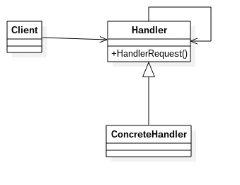

# 责任链模式
---
责任链模式：使多个对象都有机会处理请求，从而避免了请求的发送者和接受者之间的耦合关系。将这些对象连成一条链，并沿着这条链传递该请求，直到有对象处理它为止。
责任链模式的重点在*链*上，由一条链去处理相似的请求在链中决定谁来处理这个请求，并返回相应的结果。*链*是由多个处理者ConcreteHandler组成的。
**类图**

	
    	//抽象处理者
        public abstract class Handler {
        	private Handler nextHandler;
            //每个处理者都必须对请求做出处理
            public final Response handlerMessage(Request request) {
            	Response response = null;
                //判断是否是自己的处理级别
                if (this.getHandlerLevel().equals(request.getRequestLevel())) {
                	response = this.echo(request);
                } else {	//不属于自己的处理级别
                	//判断是否有下一个处理者
                    if (this.nextHandler != null) {
                    	response = this.nextHandler.handlerMessage(request);
                    } else {
                    	//没有适当的处理者，业务自行处理
                    }
               }
            }

            //设置下一个处理者
            public void setNextHandler(Handler handler) {
            	this.handler = handler;
            }
            
            //处理者可以处理的级别
            protected abstract Level getHandlerLevel();
            
            //处理者都必须实现处理任务
            protected abstract Response echo(Request request);
        }
        
抽象处理者是实现三个职责：
- 定义一个请求的处理方法handlerMessage
- 定义一个链的编排方法setNext，设置下一个处理者
- 定义具体的请求者必须实现的两个方法——定义自己的处理级别和具体的处理逻辑

		//具体处理者
        public class ConcreteHandler1 extends Handler {
        	//定义自己的处理逻辑
            protected Response echo(Request request) {
            	//完成处理逻辑
                return null;
            }
            
            //设置自己的处理级别
            protected Level getHandlerLevel() {
            	//设置自己的处理级别
                return null；
            }
        }
        
        public class ConcreteHandler2 extends Handler {
        	//定义自己的处理逻辑
            protected Response echo(Request request) {
            	//完成处理逻辑
                return null;
            }
            
            //设置自己的处理级别
            protected Level getHandlerLevel() {
            	//设置自己的处理级别
                return null；
            }
        }
        
        public class ConcreteHandler3 extends Handler {
        	//定义自己的处理逻辑
            protected Response echo(Request request) {
            	//完成处理逻辑
                return null;
            }
            
            //设置自己的处理级别
            protected Level getHandlerLevel() {
            	//设置自己的处理级别
                return null；
            }
        }
        
        //级别对象
        public class Level {
        	//定义一个请求和处理级别
        }
        
        //请求对象
        public class Request {
        	//请求级别
            public Level getRequestLevel() {
            	return null;
            }
        }
        
        //响应对象
        public class Response {
        	//处理者返回的对象
        }
        
        //场景类
        public class Client {
        	public static void main(String[] args) {
            	//声明所有的处理节点
                Handler handler1 = new ConcreteHandler1();
                Handler handler2 = new ConcreteHandler2();
                Handler handler3 = new ConcreteHandler3();
                //设置先后顺序
                handler1.setNext(handler2);
                handler2.setNext(handler3);
                //提交请求，并拿到返回结果
                Response response = handler1.handlerMessage(new Request());
            }
        }
        
责任链模式的优缺点
**优点**:将请求和处理分开——请求者可以不用知道谁是最终的处理者，处理者也不用知道请求的全貌。两者解耦，提高系统的灵活性。
**缺点**:一是性能问题，每个请求都是从链首开始，特别是链比较长时，性能是非常大的问题；二是调试不方便
**注意事项**:链中的节点数量需要控制，避免出现超长链。一般做法实在Handler中设置一个最大节点数量，在setNext方法中判断是否已经是超过其阀值，超过则不允许该链的建立，避免无意识地破坏系统的性能。

责任链模式举例
例子说明:申请聚餐费用的管理。
　　很多公司都是这样的福利，就是项目组或者是部门可以向公司申请一些聚餐费用，用于组织项目组成员或者是部门成员进行聚餐活动。
　　申请聚餐费用的大致流程一般是：由申请人先填写申请单，然后交给领导审批，如果申请批准下来，领导会通知申请人审批通过，然后申请人去财务领取费用，如果没有批准下来，领导会通知申请人审批未通过，此事也就此作罢。
　　不同级别的领导，对于审批的额度是不一样的，比如，项目经理只能审批500元以内的申请；部门经理能审批1000元以内的申请；而总经理可以审核任意额度的申请。
　　也就是说，当某人提出聚餐费用申请的请求后，该请求会经由项目经理、部门经理、总经理之中的某一位领导来进行相应的处理，但是提出申请的人并不知道最终会由谁来处理他的请求，一般申请人是把自己的申请提交给项目经理，或许最后是由总经理来处理他的请求。
  例子代码参见chain文件夹