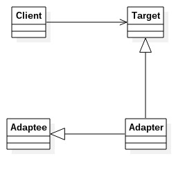

# 适配器模式
---
适配器模式：将一个类的接口变成客户端所期待的另一种接口，从而使原本接口不匹配而无法在一起工作的两个类能一起工作。简单地说适配器模式就是把一个接口或类转换成其他的接口或类。适配饰模式也叫做变压器模式、包装模式（不止一种）。
类图:

类图中角色说明
- Target目标角色：该角色定义了把其他类转换为何种接口，也就是我们期望的接口。
- Adaptee源角色：待转换的角色
- Adpater适配器角色：适配器角色的核心角色，其他两个角色都是已经存在的角色，而适配器角色需要新建立的，它的职责非常简单——将源角色转换为目标角色。通过继承或关联的方式完成转换。

		//目标角色
        public interface Target {
        	//目标角色有自己的方法
            public void request();
        }
        
        //目标角色的实现类
        public class ConcreteTarget implements Target {
        	@Override
            public void request() {
            	System.out.println("If you need any help,please call me!");
            }
        }
        
        //源角色
        public class Adaptee {
        	//原有的业务逻辑
            public void doSomething() {
            	System.out.println("I'm kind of busy,leave me alone,please!");
            }
        }
        
        //适配器角色
        public class Adapter extends Adaptee implements Target {
        	@Override
            public void request() {
            	super.doSomething();
            }
        }
        
        //场景类
        public class Client {
        	public static void main(String[] args) {
            	Target target = new ConcreteTarget();
                target.request();
                //适配器角色
                Target target2 = new Adapter();
                target2.request();
            }
        }
        
### 适配器模式的优缺点和应用场景
**优点**
- 适配器模式可以让两个没有任何关系的类在一起运行
- 增加类的透明性：访问target对象，具体的实现都有Adapter完成，高层模块不需要关系源对象与目标间的转换
- 提高了类的复用度：源对象在原有系统中依然正常使用，而在目标角色中也可以充当新的对象使用
- 灵活性非常好

**使用场景**
你有动机修改或扩展一个已经投产中的接口时，适配器模式可能就是最适合的选择。

**注意：**适配器模式最好在设计阶段不要考虑它，它不是为了解决还处在开发阶段的问题，而是为了解决正在服务的项目的问题

举例说明：公司开发新的项目，由于人手不足从人力外包公司引入外包人员协助开发。外包人员的信息公司也要知道并且按自己员工的方式管理。但外包方的员工信息IOuterUser类的表述和己方员工信息类IUserInfo有出入。
借助适配器模式来解决。例子代码参见adapter文件夹
类图：

