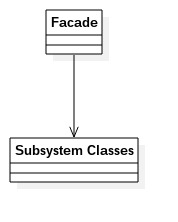
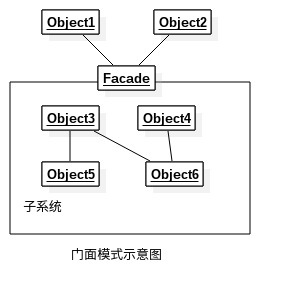

# 门面模式
---
门面模式：要求一个子系统的外部与其内部的通信必须通过一个统一的对象进行。门面模式也叫外观模式，提供了一个高层次的接口，使得子系统更易使用。门面模式注重“统一的对象”，也就是提供一个访问子系统的接口，除了这个接口不允许有任何访问子系统的行为发生。
**类图** 
   

类图中角色说明:
- Facade门面角色
- Subsystem子系统角色

        //子系统
        public class ClassA {
            public void doSomethingA() {
                //业务逻辑
            }
        }

        public class ClassB {
            public void doSomethingB() {
                //业务逻辑
            }
        }

        public class ClassC {
            public void doSomethingC() {
                //业务逻辑
            }
        }

        //门面对象
        public class Facade {
            //被委托的对象
            private ClassA a = new ClassA();
            private ClassB b = new ClassB();
            private ClassC c = new ClassC();

            //提供给外部的访问方法
            public void methodA() {
                this.a.doSomethingA();
            }

            public void methodB() {
                this.a.doSomethingB();
            }

            public void methodC() {
                this.a.doSomethingC();
            }
        }
    
### 门面模式的优缺点和应用场景
**优点**
- 减少系统的相互依赖：所有的依赖都是对门面对象的依赖，与子系统无关
- 提高了灵活性：子系统的内部的变化，只要不影响到门面对象，就无需修改
- 提高了安全性：访问子系统，只能通过门面对象进行，只能访问门面对象中定义的

**缺点**
门面对象是门面模式的重点，门面对象出错只能修该代码

**应用场景**
- 为一个复杂的模块或子系统提供一个供外界访问的接口
- 子系统相对独立——外界对子系统的访问只要黑箱操作即可
- 预防低水平人员带来的风险扩散

**注意事项**
一般情况下，一个子系统只要有一个门面就足够了，在以下的情况下需要设置多个门面对象
- 门面已经庞大到不能忍受的程度
- 子系统可以提供不同的访问路径

### 门面不参与子系统的业务逻辑
现在：ClassC对方法在执行前，必须先调用ClassA的方法
	
    //门面对象
    public class Facade {
    	//被委托的对象
        private ClassA a = new ClassA();
        private ClassB b = new ClassB();
        private ClassC c = new ClassC();
        
        //提供给外部的访问方法
        public void methodA() {
        	this.a.doSomethingA();
        }
        
        public void methodB() {
        	this.a.doSomethingB();
        }
        
        public void methodC() {
        	this.a.doSomethingA();
        	this.a.doSomethingC();
        }
    }
    
***注意***:这种做法是非常不靠谱的，因为门面对象参与了业务逻辑。*门面模式只是提供一个访问子系统的一个路径而已，它不应该也不能参与具体的业务逻辑，否则就会产生一个倒依赖问题*

	//提供封装类
    public class Context {
    	//委托处理
        private ClassA a = new ClassA();
        private ClassC c = new ClassC();
        
        //复杂业务
        public void complexMethod() {
        	this.a.doSomethingA();
            this.c.doSomethingC();
        }
    }
    
    //门面对象
    public class Facade {
    	//被委托的对象
        private ClassA a = new ClassA();
        private ClassB b = new ClassB();
        private Context context = new Context();
        
        //提供给外部的访问方法
        public void methodA() {
        	this.a.doSomethingA();
        }
        
        public void methodB() {
        	this.a.doSomethingB();
        }
        
        public void methodC() {
        	this.Context.complexMethod();
        }
    }
门面对象应该是稳定的，它不应该经常变化，一个系统一旦投入运行它就不应该被改变，它是一个系统对外的接口。